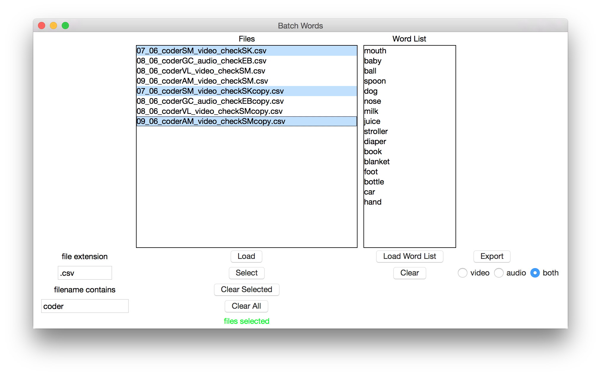

# batchwords

This program operates on batches of audio/video coding csv files, pulling out matches based on a word list provided by the user. The matches can then be exported to a new csv file. The new csv entries will include:

* child_visit
* word
* utterance_type
* object_present
* speaker
* basic_level
* audio or video

for every entry pulled out of the batch csv files, regardless of whether they came from audio or video files.

You can exclude audio or video files, or choose to include both of them in the final export results.

##running

```bash
$ python batchwords.py
```



##issues

Please report any bugs to the Github issue tracker.
